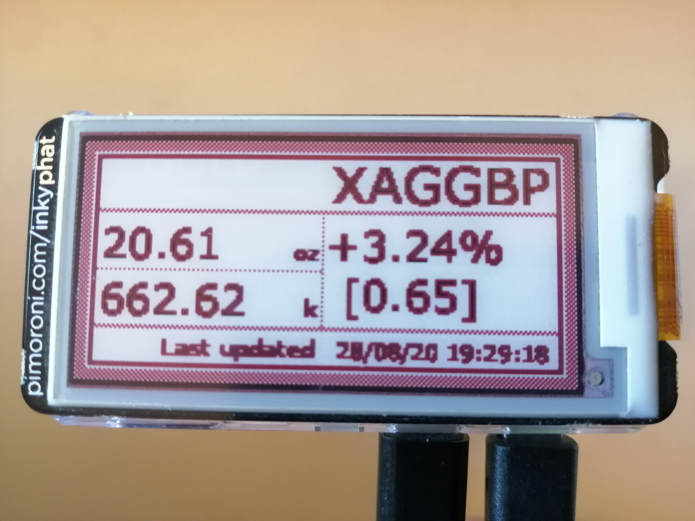

# [HE]avy [ME]tals Raspberry [PI] - Hemepi

Precious Metals prices tracker with Raspberry Pi + InkyPhat epaper display


## Prerequisites

### Hardware

1. [Pi Zero](https://shop.pimoroni.com/products/raspberry-pi-zero-w) (preferably the wireless version)
2. [InkyPhat display](https://shop.pimoroni.com/products/inky-phat?variant=12549254217811)

### Hardware setup

SPI must be enabled on the Raspberry PI:

```
sudo raspi-config nonint do_spi 0
```

You MUST reboot after setting this option

### API key

Register with [goldapi](https://www.goldapi.io) and get an API key. They offer
a limited free API key.

## Development

It is expected that you will be developing on your host machine, not the PI
directly. This means you have nothing to setup on the PI appart from the
hardware and hardware configurations as described in the prerequisits.
## Testing

```
make test
```

## Building

```
make build
```

## Deploying

The Makefile has a command for deploying, modify the target device user and
host as required.
```
make deploy
```

You can also copy the binary to a suitable location on your RPI, e.g:

```
scp hemepi pi@raspberrypi.local:/usr/local/bin
```

## Usage

Execute the binary, passing in at least the mandatory api key flag as follows:

```
sudo ./hemepi -metal=XAU -currency=GBP -apikey=<your.api.key>
```

You have various configuration flags to alter the connection to the display or
the frequency data is collected from the external API

```
HeMePI - [HE]vy [ME]tal Raspberry [PI] Gold and Silver price tracker

Usage of ./hemepi:
  -apikey string
    	API key for goldapi.io
  -currency value
    	Currency to get metal price in
  -metal value
    	Metal to get price for
  -model value
    	Inky model (PHAT or WHAT)
  -model-color value
    	Inky model color (black, red or yellow) (default red)
  -reset string
    	Inky reset pin (default "27")
  -spi string
    	Name or number of SPI port to open (default "/dev/spidev0.0")
  -dc string
    	Inky DC pin (default "22")
  -busy string
    	Inky busy pin (default "17")
  -border-color value
    	Border color( black, white, red or yellow
```
## Automatically running

You can setup a cronjob so that the program will run at set times/intervals.
The following example will get Gold every even minute, and Silver every odd
minute. If you do this you must make sure your Goldapi.io account type has the
required request limits.

To edit your cron type the following (must be run as sudo)
```
sudo crontab -e
```

Add the following for switching between Gold and Silver every 30 minutes weekdays
only (metal markets close over the weekend)
```
0 * * * 1-5 /home/pi/hemepi/hemepi -metal=XAG -currency=GBP -apikey=<your.api.key>
30 * * * 1-5 /home/pi/hemepi/hemepi -metal=XAU -currency=GBP -apikey=<your.api.key>
```

## License

This project is licensed under the terms of the GNU General Public License v3.0.
